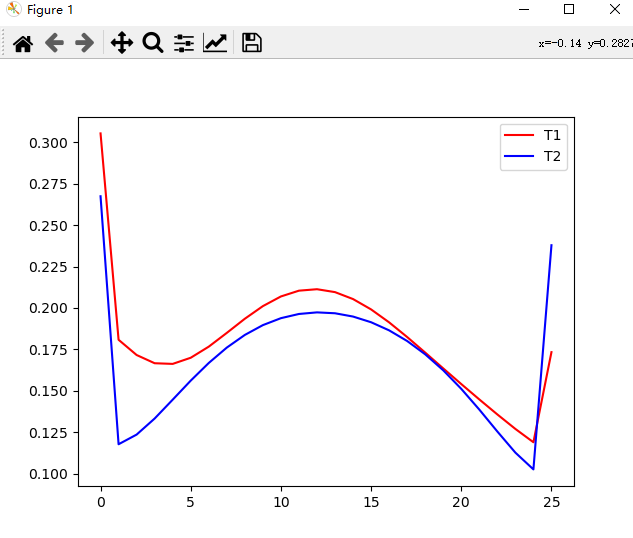
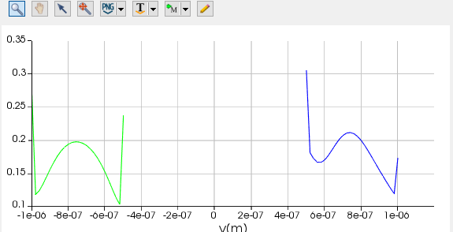
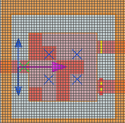

# 例程:简单的例子{#simple}

我们先来看一个简单的仿真例子，这个例子中我们定义了一个简单的器件，并放置了光源，定义了仿真区域、边界条件、输入模式等等，并在最后将仿真的结果通过监视器输出，以numpy格式导入到了python中，并最后通过matplotlib可视化。

**注意：本示例中引用了bidict、matplotlib等软件包，若没有安装，请参考附录中的[软件包安装](附录.md#pipinstall)**

```
import lumapi
import numpy as np
from collections import OrderedDict
from bidict import bidict
import matplotlib.pyplot as plt

def init_base(mode,size=(2,2)):
    mode.switchtolayout()
    # 基底生成
    # mode.importmaterialdb("fdtd_files/material.mdf")  #加载材料数据
    mode.addrect(x=0, y=0.0, z=-1.11e-6,x_span=2e-5,y_span=1e-5,z_span=2e-6,name="box",material="SiO2 (Glass) - Palik")
    mode.addrect(x=0, y=0.0, z=0,x_span=2.6e-6,y_span=2.6e-6,z_span=0.22e-6,name="Si (Silicon) - Palik",material="Si (Silicon) - Palik")
    mode.addrect(x=-5.15e-6, y=0.0, z=0, x_span=7.7e-6, y_span=0.5e-6, z_span=0.22e-6, name="in",
                 material="Si (Silicon) - Palik")
    mode.addrect(x=5.15e-6, y=0.75e-6, z=0, x_span=7.7e-6, y_span=0.5e-6, z_span=0.22e-6, name="out1",
                 material="Si (Silicon) - Palik")
    mode.addrect(x=5.15e-6, y=-0.75e-6, z=0, x_span=7.7e-6, y_span=0.5e-6, z_span=0.22e-6, name="out2",
                 material="Si (Silicon) - Palik")
    mode.addmesh(x=0, y=0, z=0, x_span=2.6e-6, y_span=2.6e-6, z_span=0.22e-6, name="mesh",
                 dx=0.02e-6,dy=0.02e-6,dz=0.02e-6,)
    mode.addvarfdtd(x=0, y=0, z=0,x_span=4e-6, y_span=4e-6, z_span=0.8e-6,simulation_time=1000e-15,x0=-1.48565e-6)

    #通过OrderedDict顺序设置模型参数
    source_props = OrderedDict([("name", "source"), ("injection axis", "x"),
                         ("x", -1.7e-6), ("y", 0),("y span", 2e-6),
                         ("selected mode number",2),
                         ("center wavelength",1.55e-6),("wavelength span",0.2e-6),
                         ("optimize for short pulse", 1)
                         ])
    mode.addmodesource(properties=source_props)

    # OrderedDict也可以这样给
    mode.addpower(properties=OrderedDict([("name", "T1"), ("monitor type", "2D X-normal"),
                                        ("x", 1.45e-6), ("y", 0.75e-6),("z",0),
                                        ("y span", 0.5e-6),("z span",0.4e-6),
                                        ("override global monitor settings", True),("frequency points",1)]))
    mode.addpower(properties=OrderedDict([("name", "T2"), ("monitor type", "2D X-normal"),
                                        ("x", 1.45e-6), ("y", -0.75e-6),("z",0),
                                        ("y span", 0.5e-6),("z span",0.4e-6),
                                        ("override global monitor settings", True),("frequency points",1)]))


    # pattern生成
    rows, columns = size[0], size[1]
    mode.addstructuregroup(name="666")
    x_span = 2.6e-6 / columns
    y_span = 2.6e-6 / rows
    for row in range(rows):
        for column in range(columns):
            #模型在放置之后，默认选择的就是这个模型，就像下面这里，放置矩形之后可以直接将其加入到模型组之中，不用重新选择
            mode.addrect(x=-1.3e-6 + x_span / 2 + column * x_span, x_span=x_span,
                         y=1.3e-6 - y_span / 2 - row * y_span, y_span=y_span,
                         z=0, z_span=0.22e-6, name=str(row) + "r" + str(column) + "c",
                         material="etch")
            mode.addtogroup("666")

def change_pattern(mode,pattern_matrix):
    mode.switchtolayout()
    pattern_dic=bidict({
        "Si (Silicon) - Palik":1,
        "etch":0
    })
    for row in range(pattern_matrix.shape[0]):
        for column in range(pattern_matrix.shape[1]):
            mode.select("666::"+str(row)+"r"+str(column)+"c")
            pix = mode.getObjectBySelection()
            material_name=pix.material
            if pattern_dic[material_name]!=pattern_matrix[row][column]:
                pix.material=pattern_dic.inverse[pattern_matrix[row][column]]

def get_result(mode):
    t1 = mode.getresult("T1", "E")["E"].squeeze()
    t2 = mode.getresult("T2", "E")["E"].squeeze()
    #这里a,b是两个监视器的电场幅值，即xyz方向的平方相加开根
    a = np.sqrt(np.sum(np.power(np.abs(t1), 2), axis=1))
    b = np.sqrt(np.sum(np.power(np.abs(t2), 2), axis=1))
    return a,b

if __name__ == '__main__':
    row_num = 5
    column_num = 5

    mode = lumapi.MODE()
    init_base(mode, size=(row_num, column_num))
    #保存为项目文件
    mode.save("fdtd_files/base"+str(row_num)+"_"+str(column_num)+".lms")

    # 初始化pattern
    best_pattern_matrix = np.random.randint(0, 2, (row_num, column_num))
    change_pattern(mode,best_pattern_matrix)
    mode.run()
    a,b=get_result(mode)

    #绘图，可以和软件中自带的可视化比较一下
    fig, ax = plt.subplots(1)
    ax.plot(np.arange(len(a)),a,c='r',label='T1')
    ax.plot(np.arange(len(b)), b, c='b', label='T2')
    plt.legend()
    plt.show()

```

以上程序运行结束之后会画出两个输出端口的电场幅值分布：




对应mode中的监视器可视化：



器件结构：



能够看到数据正确。


