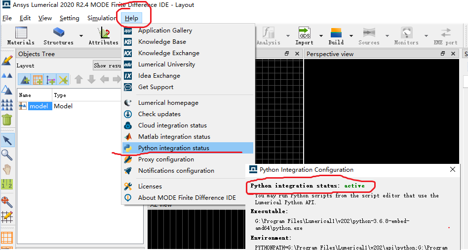

## 前言{#init}
安装主要分为三个部分：
1. lumerical的安装
2. python 环境的安装
3. python 联合 lumerical的api的初始环境设置


## lumerical{#lumerical}
根据lumerical官方的说法：  https://support.lumerical.com/hc/en-us/articles/360037824513-Python-API-overview


为了能够正常使用python的接口，我们需要三个条件：

1. 自动化python api证书
2. 2019a R3 或者更新的lumerical 软件版本
3. 在Linux上：为支持的Linux系统运行bashshell的gnome终端

***其中最主要的，就是需要2019a R3版本以上的软件。***

这里不会提供下载方式，可以在大学内部的网站进行下载：（蝴蝶、byr什么的）

安装并激活之后，可以从下图中查看python api是否激活（这里以mode为例）：




## python{#python}

python的环境配置有很多种，每个人的习惯都不同，所以这里仅简要写一下个人配置的环境

本人的环境是：win10 + miniconda + pycharm + jupyter notebook

解释一下，做大型工程时，主要使用pycharm，做小型测试和数据可视化的时候，则主要使用jupyter。


## python+lumerical环境结合{#python}

lumerical公司提供的python api接口为软件自带的一个py文件，我们只需要在使用中能够导入就行。

假设你的lumerical安装路径在C盘，则python文件的路径为"C:\Program Files\Lumerical\v202\api\python\lumapi.py"
> 路径中的v202是版本号，各位看需进行更改

那么如何将这个文件导入呢？

这里提供一个一劳永逸的方法：自定义一个pth文件，这样python就能直接`import lumapi`了

方法如下：

假设你的lumapi安装在c盘，miniconda中的虚拟环境叫做fdtd，并安装在g盘，那么

1. 在`G:\miniconda\envs\fdtd\Lib\site-packages`路径下新建`lumapi.pth`文件，内容为`C:\Program Files\Lumerical1\v202\api\python`
2. 在编程环境中激活虚拟环境fdtd，输入
```
import sys
print('\n'.join(sys.path))

G:\miniconda\envs\fdtd\python38.zip
G:\miniconda\envs\fdtd\DLLs
G:\miniconda\envs\fdtd\lib
G:\miniconda\envs\fdtd
G:\miniconda\envs\fdtd\lib\site-packages
G:\Program Files\Lumerical1\v202\api\python
G:\miniconda\envs\fdtd\lib\site-packages\win32
G:\miniconda\envs\fdtd\lib\site-packages\win32\lib
G:\miniconda\envs\fdtd\lib\site-packages\Pythonwin
```
就能够看到fdtd这个虚拟环境已经成功将lumerical的python路径导入了。


## 结尾
如果上述安装全都没有出问题，现在就能够开始仿真了。

打开你熟悉的py编程环境，尝试输入一下代码并保存运行，看看效果吧：

```
import lumapi

mode = lumapi.MODE()
mode.addrect(x=0, y=0.0, z=-1.11e-6,x_span=2e-5,y_span=1e-5,z_span=2e-6,name="box",material="SiO2 (Glass) - Palik")
input()
```

**注意！ lumapi依赖于numpy库，所以如果导入报错了，则需要在环境中另外安装numpy！**

接下来会写如何使用python api完全代替图形化的操作，包括多线程、会话管理这些。